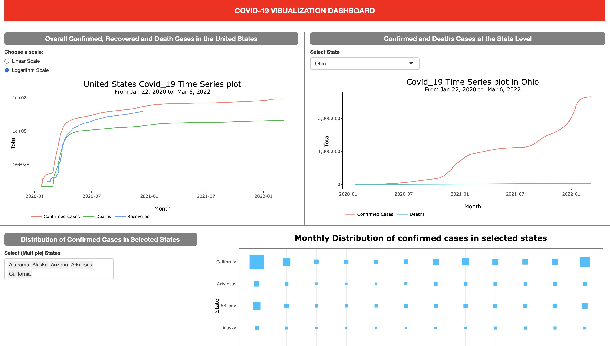

# COVID-19 Dashboard
A dashboard created with R Shiny to provide users the flexibility to interact with different visualizations revealing the distribution and trends in COVID-19 confirmed cases and deaths.

